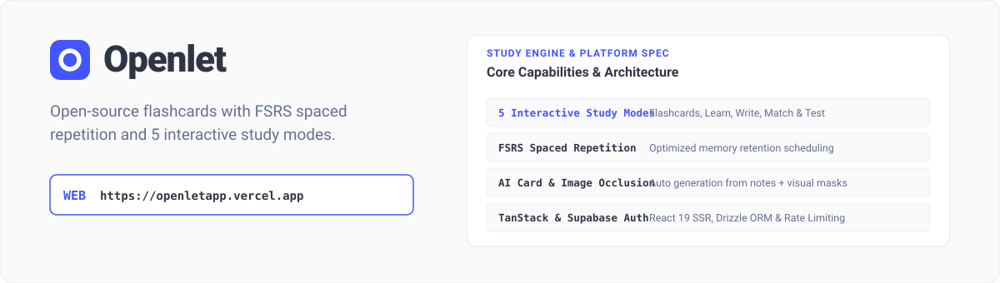

<p align="center">
  
</p>

<p align="center">
  <a href="LICENSE">
    
  </a>
  <a href="https://openletapp.vercel.app">
    
  </a>
  
  
</p>

---

## Overview

`Openlet` is a free, open-source flashcard application featuring FSRS spaced repetition scheduling. It delivers a premium, paywall-free study experience designed for students, developers, and researchers.

With support for 5 interactive study modes, automatic AI flashcard generation, image occlusion, bulk CSV imports, and collaborative deck sharing, Openlet provides an end-to-end learning platform built on modern open-source web technologies.

> **Live Web Application**  
> Explore the live application: [https://openletapp.vercel.app](https://openletapp.vercel.app)

<br />

<p align="center">
  
</p>

---

## Core Capabilities

- **Five Study Modes**: Study with Flashcards, Learn (FSRS spaced repetition), Write, Match, and Test environments.
- **FSRS Spaced Repetition**: Utilizes a custom FSRS implementation (`lib/fsrs.ts`) for memory scheduling and optimal retention intervals.
- **AI Flashcard Generation**: Automatically generate study decks directly from lecture notes, textbooks, or raw text.
- **Image Occlusion**: Create visual study cards by masking specific regions of diagrams and medical images.
- **Data Ingestion**: Support for direct CSV uploads and bulk text pasting.
- **Collaborative Folders & Classes**: Share decks via public links with built-in visibility controls and access permissions.
- **Supabase Authentication**: Seamless Google and GitHub single sign-on powered by Supabase Auth with SSR cookie sessions.
- **Token Bucket Rate Limiting**: Postgres-backed rate limiting on all API routes to protect server endpoints.

---

## Technology Stack

| Architecture Component | Technology Choice | Functionality & Role |
|---|---|---|
| **Framework** | [TanStack Start](https://tanstack.com/start) | React 19 server-side rendering and full-stack web architecture |
| **Routing Engine** | [TanStack Router](https://tanstack.com/router) | Type-safe file-based client and server routing |
| **Styling Infrastructure** | [Tailwind CSS v4](https://tailwindcss.com) | Production design system and UI primitive styling |
| **Database Engine** | [Postgres](https://postgresql.org) on [Supabase](https://supabase.com) | Primary relational storage with Row Level Security (RLS) |
| **ORM** | [Drizzle ORM](https://orm.drizzle.team) | Type-safe SQL schema definitions and migrations |
| **Authentication** | [Supabase Auth](https://supabase.com/auth) | Google and GitHub OAuth with SSR session management |
| **Hosting Platform** | [Vercel](https://vercel.com) | Edge deployment with automatic preview environments |
| **Spaced Repetition** | [FSRS Engine](https://github.com/open-spaced-repetition/fsrs.js) | Custom memory retention calculation engine |

---

## Getting Started

### System Prerequisites
- Node.js v20.0.0 or higher
- `pnpm` package manager (`npm i -g pnpm`)
- A Supabase project (free tier fully supported)

### Local Development Setup

1. Clone the repository and install dependencies:

```bash
git clone https://github.com/ChloeVPin/openlet.git
cd openlet
pnpm install
```

2. Configure environment variables:

```bash
cp .env.example .env
```

Fill in `DATABASE_URL`, `VITE_SUPABASE_URL`, and `VITE_SUPABASE_ANON_KEY` with your Supabase API credentials.

3. Apply database schema and RLS security migrations:

```bash
pnpm drizzle-kit push
node --env-file=.env scripts/apply-migration.mjs
```

4. Launch the local development server:

```bash
pnpm dev
```

Navigate to `http://localhost:3000` in your web browser.

---

## Environment Variables Matrix

| Environment Variable | Required | Description |
|---|---|---|
| `DATABASE_URL` | Yes | Postgres connection pooler string (Supabase port 6543) |
| `VITE_SUPABASE_URL` | Yes | Supabase project URL from API settings |
| `VITE_SUPABASE_ANON_KEY` | Yes | Supabase public anonymous API key |
| `VITE_SITE_URL` | No | Target deployment URL (defaults to Vercel preview URL) |
| `NODE_ENV` | No | Target runtime environment (`development` or `production`) |

---

## OAuth Authentication Setup

To configure Google or GitHub authentication:

1. Navigate to **Authentication > Providers** in your Supabase dashboard.
2. Enable Google and GitHub OAuth options.
3. Paste the Client ID and Client Secret from your respective developer console.
4. Set the redirect callback URL to: `https://your-domain.co/auth/callback`

---

## Repository Directory Architecture

```text
openlet/
├── src/
│   ├── components/        # React components (UI primitives, study chrome, flashcards)
│   │   └── ui/            # Base UI primitives (buttons, inputs, dialogs, tooltips)
│   ├── lib/
│   │   ├── auth/          # Supabase Auth actions & SSR middleware
│   │   ├── supabase/      # Supabase client configuration
│   │   └── actions/       # Server functions (study sets, preferences, sharing)
│   ├── routes/            # TanStack Router file-based route definitions
│   │   ├── api/           # API endpoints (dashboard, card metadata, sets)
│   │   └── set.$id.*      # Study mode controllers (flashcards, learn, write, match, test)
│   ├── router.tsx         # Router configuration & route tree registry
│   └── start.ts           # TanStack Start entry point
├── lib/
│   ├── db/                # Drizzle database schema & connection pooler
│   ├── fsrs.ts            # FSRS spaced repetition algorithm logic
│   └── types.ts           # Shared TypeScript interfaces
├── drizzle/               # Database migration states
├── public/                # Static assets (logos, icons, web manifest)
├── scripts/               # Migration & test seeding scripts
└── tests/                 # Unit, security & integration test suites
```

---

## License & Contributing

- **License**: Released under the [MIT License](LICENSE).
- **Contributions**: Openlet is fully open source. Pull requests and feature proposals are welcome.
