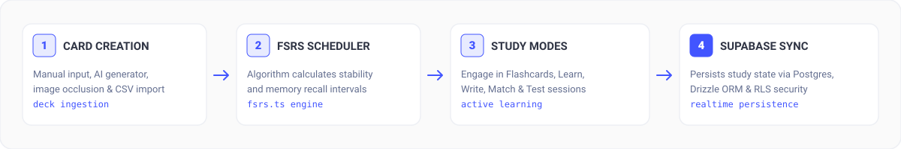

<div align="center">
  

  <h1>Openlet</h1>

  <p>Open-source flashcards with FSRS spaced repetition.</p>

  <p>
    <a href="LICENSE"></a>
  </p>
</div>

## Overview

Openlet is a free and open-source flashcard application. It uses the FSRS spaced-repetition algorithm to schedule reviews.

Openlet supports five study modes. It can generate flashcards with AI, make image-occlusion cards, import CSV files, and share decks. It does not require a paid subscription.

<br />

<p align="center">
  
</p>

---

## Main Capabilities

- **Five study modes**: Use Flashcards, Learn, Write, Match, or Test mode.
- **FSRS spaced repetition**: Use the custom implementation in `lib/fsrs.ts` to calculate review intervals.
- **AI flashcard generation**: Create study decks from lecture notes, textbooks, or plain text.
- **Image occlusion**: Mask selected areas of diagrams and medical images.
- **Data import**: Upload CSV files or paste multiple text items.
- **Folders and classes**: Share decks with public links and control access.
- **Supabase authentication**: Sign in with Google or GitHub. Supabase Auth stores the session in SSR cookies.
- **Rate limiting**: Use a Postgres token bucket on API routes.

---

## Technology Stack

| Component | Technology | Function |
|---|---|---|
| Framework | [TanStack Start](https://tanstack.com/start) | React 19 server rendering and full-stack application framework |
| Router | [TanStack Router](https://tanstack.com/router) | Type-safe file-based routing for client and server routes |
| Styling | [Tailwind CSS v4](https://tailwindcss.com) | UI styles and design tokens |
| Database | [Postgres](https://postgresql.org) on [Supabase](https://supabase.com) | Relational data storage with Row Level Security |
| ORM | [Drizzle ORM](https://orm.drizzle.team) | Type-safe schema definitions and migrations |
| Authentication | [Supabase Auth](https://supabase.com/auth) | Google and GitHub OAuth with SSR sessions |
| Hosting | [Vercel](https://vercel.com) | Production and preview deployments |
| Spaced repetition | [FSRS](https://github.com/open-spaced-repetition/fsrs.js) | Review-interval calculations |

---

## Get Started

### Requirements

- Node.js 20.0.0 or later
- `pnpm` package manager
- A Supabase project

Install `pnpm` when necessary:

```bash
npm i -g pnpm
```

### Local Setup

1. Clone the repository and install dependencies:

```bash
git clone https://github.com/ChloeVPin/openlet.git
cd openlet
pnpm install
```

2. Create the local environment file:

```bash
cp .env.example .env
```

3. Add values for these variables:

- `DATABASE_URL`
- `VITE_SUPABASE_URL`
- `VITE_SUPABASE_ANON_KEY`

4. Apply the database schema and security migrations:

```bash
pnpm drizzle-kit push
node --env-file=.env scripts/apply-migration.mjs
```

5. Start the development server:

```bash
pnpm dev
```

6. Open `http://localhost:3000`.

---

## Environment Variables

| Variable | Required | Function |
|---|---|---|
| `DATABASE_URL` | Yes | Supabase Postgres pooler connection string on port 6543 |
| `VITE_SUPABASE_URL` | Yes | Supabase project URL |
| `VITE_SUPABASE_ANON_KEY` | Yes | Supabase public anonymous API key |
| `VITE_SITE_URL` | No | Deployment URL. The default is the Vercel preview URL. |
| `NODE_ENV` | No | Runtime environment: `development` or `production` |

---

## Configure OAuth

To configure Google or GitHub authentication:

1. Open **Authentication > Providers** in the Supabase dashboard.
2. Enable Google, GitHub, or both.
3. Add the Client ID and Client Secret from the provider.
4. Set the callback URL to `https://your-domain.co/auth/callback`.

---

## Repository Structure

```text
openlet/
├── src/
│   ├── components/        # React components
│   │   └── ui/            # Base UI components
│   ├── lib/
│   │   ├── auth/          # Supabase Auth actions and SSR middleware
│   │   ├── supabase/      # Supabase client configuration
│   │   └── actions/       # Server functions
│   ├── routes/            # TanStack Router route definitions
│   │   ├── api/           # API endpoints
│   │   └── set.$id.*      # Study-mode controllers
│   ├── router.tsx         # Router configuration
│   └── start.ts           # TanStack Start entry point
├── lib/
│   ├── db/                # Drizzle schema and database connection
│   ├── fsrs.ts            # FSRS implementation
│   └── types.ts           # Shared TypeScript types
├── drizzle/               # Database migration state
├── public/                # Static assets
├── scripts/               # Migration and test scripts
└── tests/                 # Unit, security, and integration tests
```

---

## License and Contributions

- **License**: [MIT License](LICENSE)
- **Contributions**: Pull requests and feature proposals are welcome.
